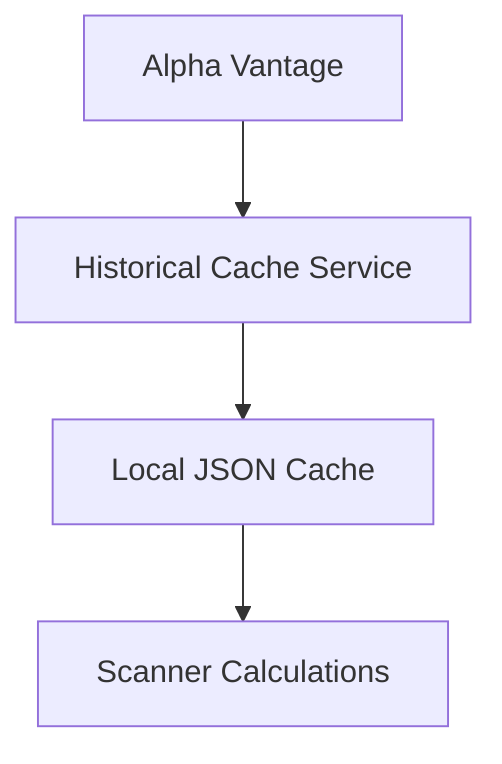
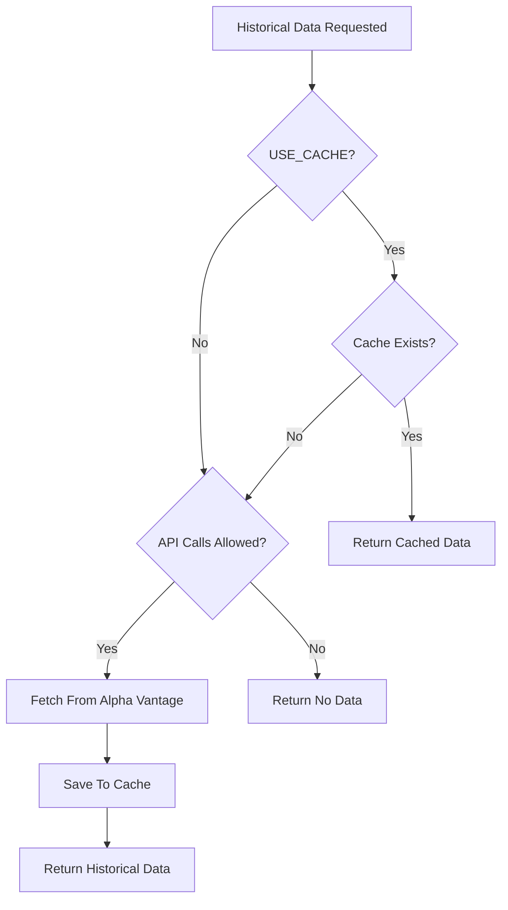
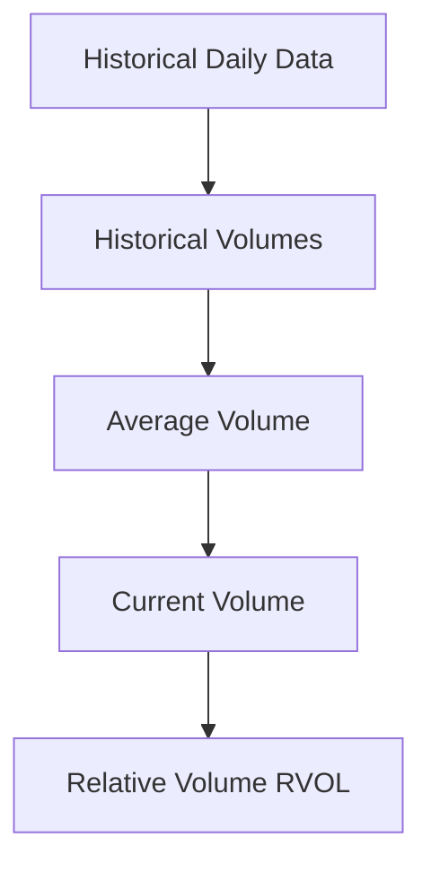

# Historical Data Cache Subsystem

[← Back to Main README](../README.md)

The STONKS Historical Data Cache stores daily market history locally to reduce API usage and provide reusable data for scanner calculations.

---

## Purpose

Scanner calculations such as Relative Volume (RVOL) and Average Volume require historical market data.

Rather than repeatedly requesting the same history from Alpha Vantage, STONKS stores historical responses locally and reuses them when available.



This reduces API usage while keeping historical scanner data readily available.

---

## Features

- Cache-first historical data retrieval
- Local JSON persistence
- Manual cache population
- Forced API refresh
- API-call disabling for local development
- Historical volume data for RVOL and Average Volume calculations

---

## Directory Structure

Historical cache data is stored under:

```text
data/
└── cache/
    └── historical/
        ├── AAPL_daily.json
        ├── TSLA_daily.json
        └── AMD_daily.json
```

Other STONKS cache directories may exist alongside `historical/`, but historical market data is isolated within this directory.

---

## Configuration

Historical cache behavior is controlled through:

```python
USE_CACHE = True
ALLOW_API_CALLS = True
```

### `USE_CACHE`

When enabled, STONKS attempts to use locally cached historical data before requesting it from the provider.

When disabled, cached historical data is bypassed.

### `ALLOW_API_CALLS`

When enabled, STONKS may request historical data from Alpha Vantage when required.

When disabled, STONKS will not make the external request.

This allows scanner and development workflows to operate from existing local data without consuming additional API requests.

---

## Cache Workflow

Normal historical-data retrieval follows:



When cached data is available and cache use is enabled, no historical API request is required.

---

## Historical Cache CLI

Historical data can be cached manually with:

```powershell
.\scripts\cache.ps1
```

Example:

```text
Symbol to cache: AAPL
Force refresh from API? (Y/N): n
```

If cached data is already available, it can be reused:

```text
Using cached historical data for AAPL

Historical data ready for AAPL.
```

If the data must be retrieved from the provider:

```text
Fetching historical data for AAPL from API...

Historical data ready for AAPL.
```

### Force Refresh

The CLI can bypass an existing cached record and request fresh historical data:

```text
Symbol to cache: AAPL
Force refresh from API? (Y/N): y
```

A forced refresh retrieves the historical data from the provider and replaces the locally cached response.

---

## Scanner Usage

The scanner uses historical market data to calculate Average Volume and Relative Volume.



Relative Volume compares current trading volume against the stock's historical average:

```text
RVOL = Current Volume / Average Volume
```

For example:

```text
Current Volume:  5,000,000
Average Volume:  2,500,000

RVOL: 2.00
```

An RVOL of `2.00` means current volume is approximately twice the historical average used by the scanner.

The number of historical trading days used in the average is controlled by the scanner configuration.

---

## Git Tracking

Runtime cache data is intentionally excluded from Git version control.

The cache directory structure is preserved with `.gitkeep` files while generated JSON data remains untracked.

```text
data/
└── cache/
    ├── float/
    │   └── .gitkeep
    ├── historical/
    │   └── .gitkeep
    └── quotes/
        └── .gitkeep
```

This keeps generated market data out of the repository while preserving the expected cache directories.
