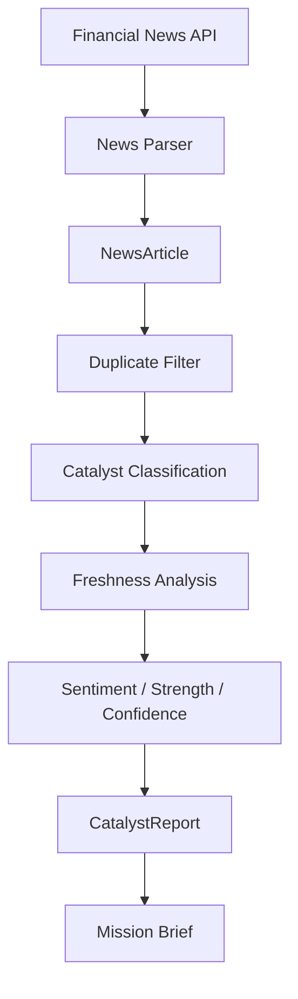

# C.I.A. — Catalyst Intelligence Analysis

[← Back to Main README](../README.md)

The STONKS C.I.A. subsystem analyzes ticker-specific financial news to help answer:

> **Why is this stock moving, and is the catalyst still relevant for day trading?**

---

## Features

- Retrieves ticker-specific financial news
- Normalizes provider data into `NewsArticle`
- Removes duplicate articles
- Classifies recognized catalyst categories
- Separates active catalysts from historical context
- Measures catalyst freshness
- Detects breaking news
- Calculates average sentiment
- Classifies overall sentiment
- Assigns catalyst strength and confidence
- Produces a structured `CatalystReport`
- Generates a human-readable Mission Brief

---

## C.I.A. Pipeline



C.I.A. separates news retrieval and analysis from presentation. The analysis pipeline produces a `CatalystReport`, while the Mission Brief converts that report into human-readable output.

---

## Catalyst Freshness

C.I.A. prioritizes recent information for day-trading analysis.

```text
0–60 minutes  → Breaking 🔥
1–4 hours     → Fresh
4–24 hours    → Recent
24+ hours     → Stale
Unavailable   → Unknown
```

Breaking, Fresh, and Recent recognized catalysts are considered active intelligence.

Older recognized catalysts remain available as historical context rather than being discarded.

---

## Catalyst Categories

C.I.A. currently recognizes:

- Contract / Purchase Order
- Acquisition
- Merger
- Earnings
- Revenue Growth
- Regulatory Approval
- Patent
- Institutional Investment
- Short Interest
- Reverse Stock Split
- Public Offering
- Bankruptcy / Restructuring
- Management Change
- Analyst Report
- Momentum / Hype

Articles that do not match a recognized category remain `Unknown`.

---

## Catalyst Report

C.I.A. aggregates its analysis into a `CatalystReport`.

The report contains:

```text
ticker
catalyst_strength
categories
historical_categories
average_sentiment
confidence
freshness
newest_catalyst_title
newest_catalyst_url
newest_catalyst_published_at
```

`categories` contains recognized active catalyst intelligence.

`historical_categories` preserves recognized catalysts that are no longer considered current enough for active day-trading intelligence.

The report acts as the boundary between catalyst analysis and presentation.

---

## Mission Brief

The Mission Brief converts a `CatalystReport` into a readable C.I.A. summary.

Example:

```text
TARGET:              DFNS
MISSION STATUS:      NO ACTIVE CATALYST

CATALYST STRENGTH:   Weak
FRESHNESS:           Stale
SENTIMENT:           Neutral (+0.08)
CONFIDENCE:          85%

CURRENT INTELLIGENCE

None

HISTORICAL CONTEXT

- Short Interest
- Reverse Stock Split
- Acquisition
- Contract / Purchase Order
```

When breaking catalyst intelligence is identified, the Mission Brief highlights it:

```text
🔥 BREAKING CATALYST DETECTED 🔥
```

---

## Analysis Roles

The major C.I.A. components have intentionally separate responsibilities:

| Component           | Responsibility                                          |
| ------------------- | ------------------------------------------------------- |
| News Parser         | Converts provider responses into `NewsArticle` models   |
| Duplicate Filter    | Removes duplicate news records                          |
| Catalyst Classifier | Identifies recognized catalyst categories               |
| Catalyst Freshness  | Determines how recent the newest recognized catalyst is |
| Catalyst Strength   | Evaluates catalyst significance                         |
| C.I.A. Engine       | Aggregates analysis into `CatalystReport`               |
| Mission Brief       | Presents the completed report to the user               |

This separation keeps news retrieval, catalyst analysis, report generation, and presentation independently maintainable.
