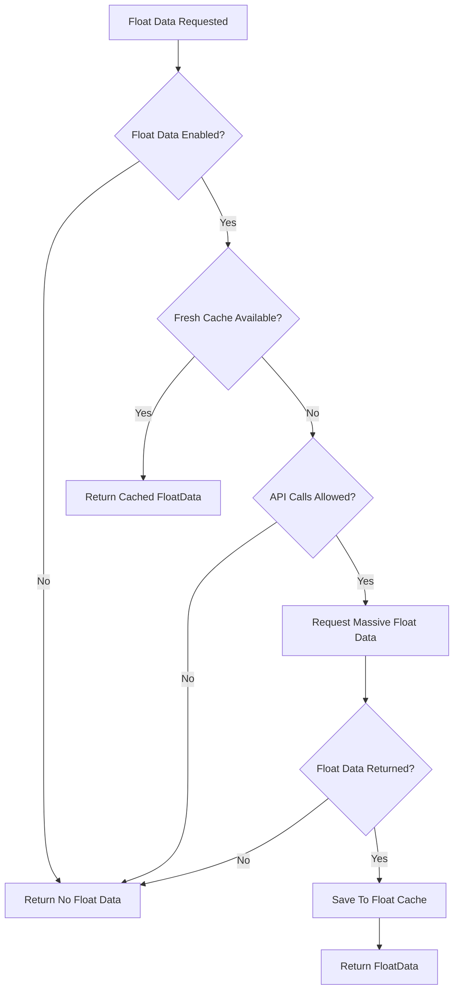
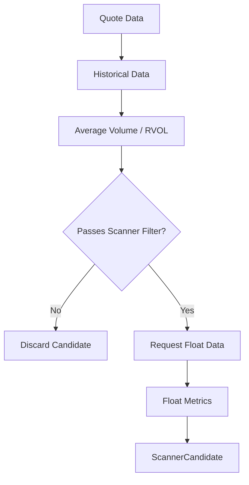

# Float Data Subsystem

[← Back to Main README](../README.md)

The STONKS Float Data subsystem enriches qualifying scanner candidates with reported public-float data and float-derived metrics.

Float data is provided by Massive and is optional. The scanner continues to operate when float support is disabled or float data is unavailable.

---

## Public Float

Public float represents shares considered available for public trading after excluding shares held by strategic or long-term holders.

STONKS tracks two provider-reported float values:

- **Float Shares** — the reported number of shares considered available for public trading
- **Float Percentage** — the percentage of total shares outstanding represented by the public float

For example:

```text
Float: 7,500,000
Float %: 62.50%
```

Float Shares provides the scanner with an absolute measure of tradable share supply.

Float Percentage provides additional context about how much of the company's outstanding stock is considered publicly tradable.

---

## Float Data Provider

STONKS retrieves public-float data from Massive.

The provider response is normalized into the `FloatData` model:

```text
symbol
float_shares
float_percent
effective_date
source
```

The provider's `effective_date` is preserved because public-float data is not real-time and may change as ownership and share structure change.

`source` identifies the provider responsible for the reported data.

---

## Configuration

Float support requires a Massive API key in `.env`:

```text
STONKS_MASSIVE_API_KEY=your_api_key
```

Float enrichment is controlled through STONKS configuration:

```python
ENABLE_FLOAT_DATA = True
FLOAT_CACHE_MAX_AGE_DAYS = 7
```

`ENABLE_FLOAT_DATA` controls whether the float subsystem is active.

`FLOAT_CACHE_MAX_AGE_DAYS` controls how long locally cached float data may be reused before STONKS attempts to refresh it.

The Massive API key and float enrichment are optional. STONKS continues to operate without them.

---

## Float Cache

Float data changes much more slowly than live market data, so STONKS caches provider responses locally.

```text
data/
└── cache/
    └── float/
        ├── AAPL_float.json
        └── SPCX_float.json
```

Each cached record contains:

```text
cached_at
symbol
float_shares
float_percent
effective_date
source
```

Two dates serve different purposes:

- `effective_date` — when the provider's reported float data became effective
- `cached_at` — when STONKS retrieved and stored that data locally

These values should not be treated as interchangeable.

---

## Float Cache Workflow



A fresh cached response avoids an unnecessary provider request.

If float data cannot be retrieved, the scanner continues without float enrichment.

---

## Scanner Integration

Float data is requested only after a stock passes the scanner's initial volume filter.



This ordering avoids spending float-provider requests on stocks that have already failed the scanner's initial qualification.

A `ScannerCandidate` contains:

```text
quote_data
float_data
float_turnover
float_classification
```

Missing float data does not remove an otherwise qualifying scanner candidate.

---

## Float Turnover

Float Turnover compares current trading volume with the stock's reported public float.

```text
Float Turnover = Current Volume / Float Shares
```

Example:

```text
Current Volume:  5,000,000
Float Shares:    10,000,000

Float Turnover:  50.00%
```

A turnover of `50%` means aggregate trading volume is equal to half of the reported public float.

Float turnover does **not** mean 50% of individual float shares have each traded exactly once. The same shares may trade repeatedly during a session.

Float turnover can therefore exceed `100%`.

### Float Turnover vs. Relative Volume

The two metrics answer different questions:

| Metric          | Question                                                                      |
| --------------- | ----------------------------------------------------------------------------- |
| Relative Volume | How unusual is today's volume compared with normal trading activity?          |
| Float Turnover  | How large is today's volume compared with the publicly tradable share supply? |

Using both provides more context than either metric alone.

---

## Float Classification

STONKS classifies stocks by their absolute reported public-float share count.

| Classification |                       Float Shares |
| -------------- | ---------------------------------: |
| Very Low       |                Less than 5 million |
| Low            |  5 million to less than 10 million |
| Medium         | 10 million to less than 50 million |
| High           |                 50 million or more |
| Unknown        |      Missing or invalid float data |

Classification is based on `float_shares`, not `float_percent`.

The classification provides a readable scanner label while preserving the exact reported float alongside it.

Example:

```text
Float: 7,500,000 | Float %: 62.50% | Effective: 2026-08-20 | Source: Massive | Float Turnover: 66.67% | Float Class: Low
```

---

## Missing Float Data

Float enrichment is intentionally non-blocking.

When float data is unavailable:

```text
float_data = None
float_turnover = None
float_classification = Unknown
```

The qualifying stock remains a valid `ScannerCandidate`.

Scanner output reports:

```text
Float: Unavailable
```

This prevents an optional provider or missing float record from interfering with the primary scanner pipeline.

---

## Limitations

Public-float data is not real-time market data.

Reported float may lag changes involving:

- Share issuance
- Public offerings
- Institutional or insider ownership
- Corporate actions
- Other changes to a company's share structure

The provider's `effective_date` should therefore be considered when evaluating float information.

Float data is intended to provide additional scanner context alongside price, volume, Relative Volume, gap, and catalyst intelligence rather than acting as an independent trading signal.
