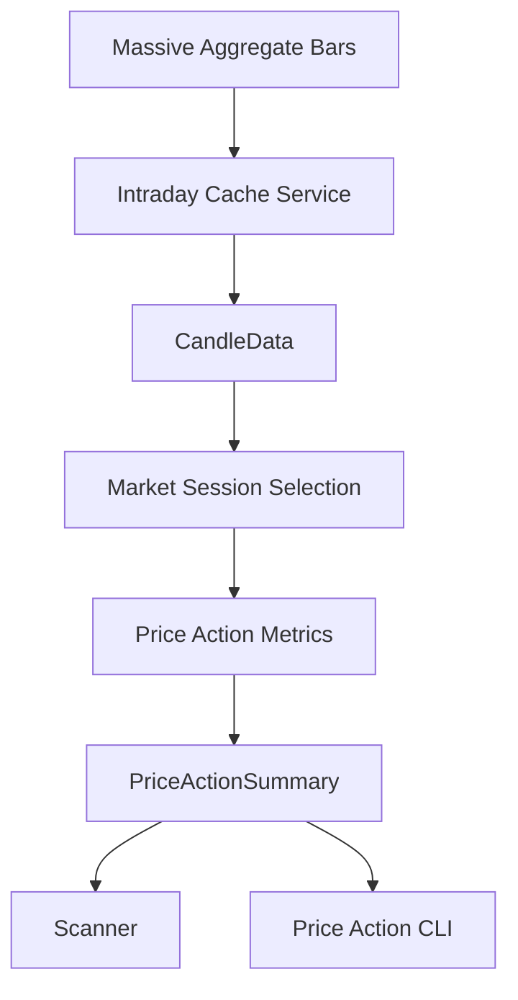
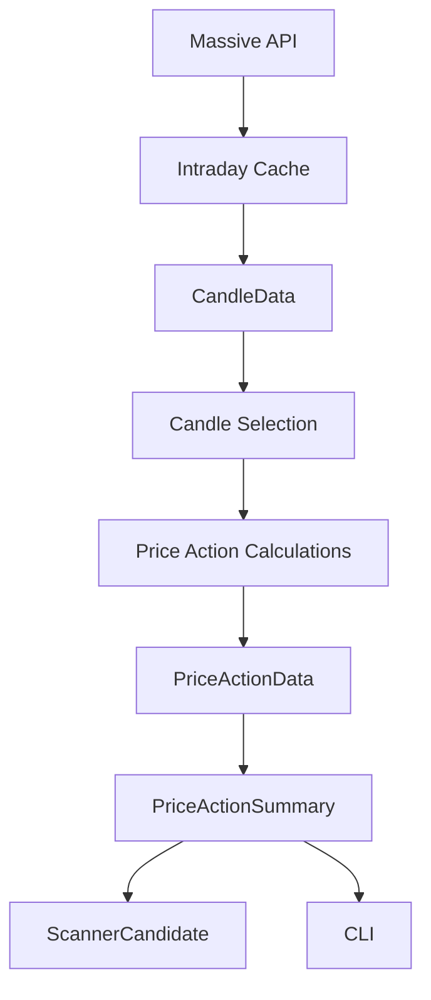

# Price Action

[← Back to Main README](../README.md)

STONKS provides historical intraday price-action analysis using candle data retrieved from Massive.

The price-action system separates market-data retrieval, caching, session selection, metric calculation, and presentation so the same analysis can be consumed by the scanner, CLI, and future interfaces.

## Overview

The price-action pipeline follows this flow:



The current implementation uses one-minute source candles and analyzes the regular U.S. trading session.

## Market Data

### CandleData

`CandleData` represents a single OHLCV trading period:

- Timestamp
- Open price
- High price
- Low price
- Close price
- Volume

Candle timestamps are stored in UTC.

### Timeframe

`Timeframe` represents the size of each candle retrieved from a market-data provider.

Supported timeframes are:

- 1 minute
- 5 minutes
- 15 minutes
- 30 minutes
- 60 minutes
- Daily

Price-action analysis currently uses one-minute candles as its source data.

A timeframe is different from a price-action lookback. A timeframe describes the size of each source candle, while a lookback describes how many recent source candles are analyzed.

For example, five one-minute candles are used to calculate the current five-minute lookback.

## Massive Aggregate Bars

Intraday candle data is retrieved through the Massive aggregate-bars endpoint.

Massive responses can contain extended-hours trading data in addition to regular-session candles. Session filtering therefore occurs after candle retrieval rather than assuming every returned candle belongs to regular market hours.

Provider responses are normalized into `CandleData` before being used by the rest of STONKS.

## Intraday Cache

Intraday market data uses cache-first retrieval.

Cache files are stored under:

```text
data/cache/intraday/
```

Cache identity includes:

```text
symbol + timeframe + start date + end date
```

Example:

```text
AMD_1min_2026-09-25_2026-09-25.json
```

Historical completed-session candle data does not currently expire.

When cached data is available, STONKS can perform price-action analysis without making another provider request.

## Market Sessions

STONKS currently recognizes three U.S. market sessions:

| Session     | Eastern Time |
| ----------- | ------------ |
| Pre-Market  | 04:00–09:30  |
| Regular     | 09:30–16:00  |
| After-Hours | 16:00–20:00  |

Market-session boundaries are defined in Eastern Time using `America/New_York`.

Candle timestamps remain stored in UTC. They are converted to Eastern Time only when determining which market session they belong to.

Session intervals use an inclusive start and exclusive end. For example, the regular session includes 09:30 but excludes 16:00.

The current implementation uses fixed session boundaries and does not include a full exchange calendar for holidays or early-close sessions.

## Candle Selection

`get_session_candles()` selects candles belonging to a requested `MarketSession`.

The function:

- Converts each timestamp to Eastern Time for classification.
- Preserves the original UTC timestamp.
- Preserves input candle order.
- Uses half-open session boundaries to avoid overlapping sessions.

`get_recent_candles()` selects the most recent candles from an already-selected dataset.

If fewer candles are available than requested, all available candles are returned.

## Price Action Metrics

STONKS currently calculates four price-action metrics.

### Period Change

Percentage change from the first candle's open to the final candle's close.

```text
(last close - first open) / first open × 100
```

### Period High

The highest candle high across the analyzed period.

### Period Low

The lowest candle low across the analyzed period.

### Period Range

Percentage distance between the period low and period high.

```text
(high - low) / low × 100
```

Metric functions are pure calculations. They do not retrieve data, access the cache, or determine market sessions.

## PriceActionData

`PriceActionData` groups the metrics calculated for one analysis window:

- Change percent
- High price
- Low price
- Range percent

This representation is used for both full-session analysis and shorter lookback windows.

## PriceActionSummary

`PriceActionSummary` represents price action for a selected market session.

It contains:

- The analyzed `MarketSession`.
- `session_data` covering the entire selected session.
- `lookbacks` containing shorter recent analysis windows.

The current scanner configuration uses:

```text
1 minute
5 minutes
10 minutes
```

Because the current source timeframe is one minute, these integer lookbacks represent the number of recent one-minute candles.

For example:

```text
1-minute lookback  → last 1 candle
5-minute lookback  → last 5 candles
10-minute lookback → last 10 candles
```

Lookbacks are configured through `PRICE_ACTION_LOOKBACKS`.

## Scanner Integration

Price action is optional enrichment data attached to `ScannerCandidate`.

After a stock passes the scanner's minimum-volume filter, STONKS:

1. Retrieves float enrichment.
2. Determines the quote's latest trading date.
3. Requests one-minute candles for that same trading date.
4. Builds regular-session price-action analysis when candle data is available.
5. Attaches the resulting `PriceActionSummary` to the candidate.

The quote's `latest_trading_day` is deliberately used so quote data and candle data describe the same trading session.

Price-action enrichment depends on the configured market-data provider having access to candle data for that trading date. With the current historical/end-of-day Massive access, a scanner running during the current trading day cannot retrieve same-day intraday candles. In that case, `price_action` remains unavailable.

STONKS does not fall back to a previous trading day's candles because doing so would combine current quote data with price action from a different market session.

Missing price-action enrichment does not remove an otherwise valid scanner candidate.

## Price Action CLI

STONKS provides a CLI for manually inspecting historical price action for a ticker and trading date.

Run:

```powershell
.\scripts\price_action.ps1
```

The CLI prompts for:

```text
Ticker: AMD
Date (YYYY-MM-DD): 2026-09-25
```

It displays:

- Raw candle count
- Selected market session
- Full-session price change
- Session high
- Session low
- Session range
- Configured recent lookbacks

The CLI uses the same cache, session-selection, and price-action calculation pipeline as the scanner.

This makes it useful for inspecting historical sessions and validating price-action behavior independently of a full scanner run.

Current-day candle availability depends on the configured Massive data plan. With historical/end-of-day access, completed sessions can be analyzed while same-day intraday requests may not be available.

## Architecture

Price-action responsibilities are intentionally separated:



This separation keeps provider and cache behavior outside the calculation layer and allows price-action analysis to be reused by multiple consumers.

The scanner and CLI therefore consume the same price-action core rather than implementing their own calculations.
